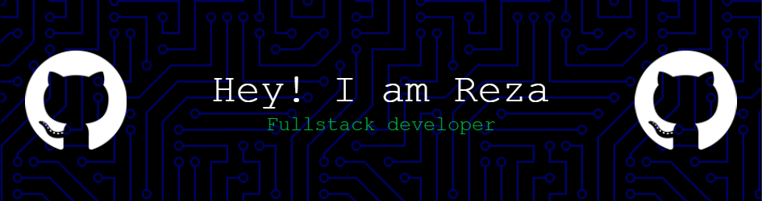

  

# Hello World, I am Reza Edi Saputra 👋

I'm a passionate Software Developer specializing in AI, Big Data, and Full Stack Development. I love exploring new technologies and building innovative solutions that solve real-world problems.

##### 🌐 Socials :

  
  
  
  
  

##### 💻 Tech Stack :

                                     

##### 📊 GitHub Stats :

  

    
  

  

    
  

  

    
  

##### 🏆 GitHub Trophies :

##### 🔝 Top Contributed Repo :

###

<h5 align="left">Feel free to listen and enjoy the vibe 🎵</h5>

###

  

###

<h5 align="left">Play Games With Me 🎮</h5>

###

###

---

##### 💰 You can help me by Donating

<!-- Proudly created with GPRM ( https://gprm.itsvg.in ) -->
